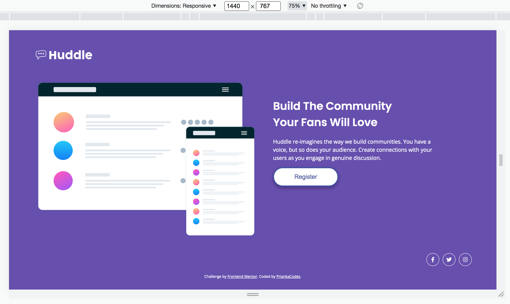
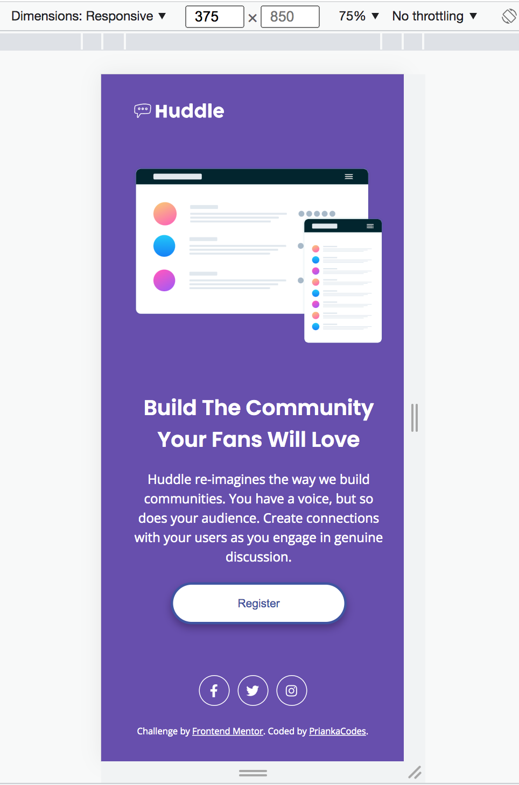

# Frontend Mentor - Huddle landing page with single introductory section solution

This is a solution to the [Huddle landing page with single introductory section challenge on Frontend Mentor](https://www.frontendmentor.io/challenges/huddle-landing-page-with-a-single-introductory-section-B_2Wvxgi0). Frontend Mentor challenges help you improve your coding skills by building realistic projects.

## Table of contents

- [Overview](#overview)
  - [The challenge](#the-challenge)
  - [Screenshot](#screenshot)
  - [Links](#links)
- [My process](#my-process)
  - [Built with](#built-with)
  - [What I learned](#what-i-learned)
  - [Continued development](#continued-development)
  - [Useful resources](#useful-resources)
- [Author](#author)
- [Acknowledgments](#acknowledgments)

## Overview

### The challenge

Users should be able to:

- View the optimal layout for the page depending on their device's screen size
- See hover states for all interactive elements on the page

### Screenshot




### Links

- Solution URL: [PriankaCodes | Frontend Mentor Solution](https://www.frontendmentor.io/solutions/responsive-landing-page-using-css-grid-skzDPjAM1)
- Live Site URL: [PriankaCodes | Huddle Landing Page](https://agitated-darwin-3a1254.netlify.app)

## My process

### Built with

- Semantic HTML5 markup
- CSS custom properties
- CSS Grid

### What I learned

My first Frontend Mentor project done. Woohoo! I am currently signed up tp the Free version which did not include the Figma files so my solution does not have the background image render. I am hoping to build a few more before signing up for a membership.
Previously, I used Bootstrap to make my project responsive, however I decided this time to code it myself using CSS grid. I found it a bit challenging on whether I was using the correct methods (ie. Flexbox or Grid) and definitely had a play around with it before settling. (Added some snippets below).

```css desktop layout vs mobile layout (Grid)
.container {
  margin: 10px;
  display: grid;
  grid-template-columns: repeat(auto-fit, minmax(500px, 1fr));
}

.container {
  margin: 0px 15px 15px 15px;
  display: grid;
  grid-template-rows: repeat(auto-fit, minmax(320px, 1fr));
}
```

### Continued development

I want to continuing developing my understanding of using CSS Grid & Flexbox. Build confidence in my coding and of course create cleaner code.

### Useful resources

- [MDN Web Docs - Basic Concepts of grid layout](https://developer.mozilla.org/en-US/docs/Web/CSS/CSS_Grid_Layout/Basic_Concepts_of_Grid_Layout) - I used this resource to gain understanding on CSS Grid.

## Author

- Frontend Mentor - [@PriankaCodes](https://www.frontendmentor.io/profile/PriankaCodes)

## Acknowledgments

Frontend Mentor is such an awesome resource. Thank you Frontend Mentor team for developing this, it's a perfect tool to develop skills, building projects and get feedback from the fellow developer community.
